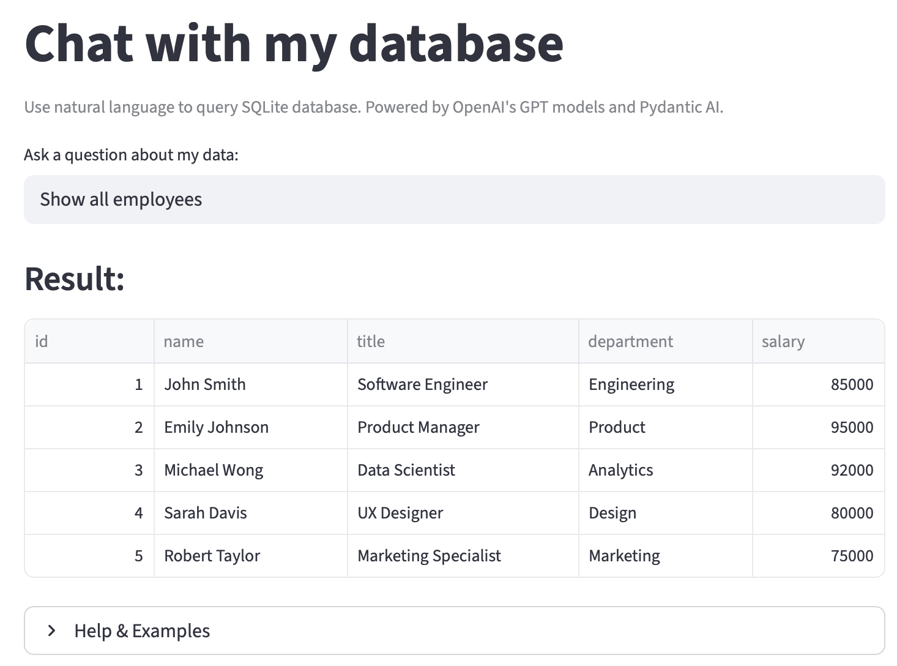

# chat-with-my-database

[](https://github.com/atrakic/chat-with-my-database/actions/workflows/ci.yml)



## Description
`chat-with-my-database` is a Streamlit app for querying SQLite data with natural language.
It uses OpenAI to turn questions into read-only SQL and show the results.

## Usage
1. Clone the repository:
   ```bash
   git clone https://github.com/atrakic/chat-with-my-database.git
   cd chat-with-my-database
   ```

2. Install dependencies:
   ```bash
   uv sync
   ```

3. Start the app.

4. Start the application:
   ```bash
   uv run src/main.py
   ```

5. Open it in your browser and enter your OpenAI API key when prompted.
