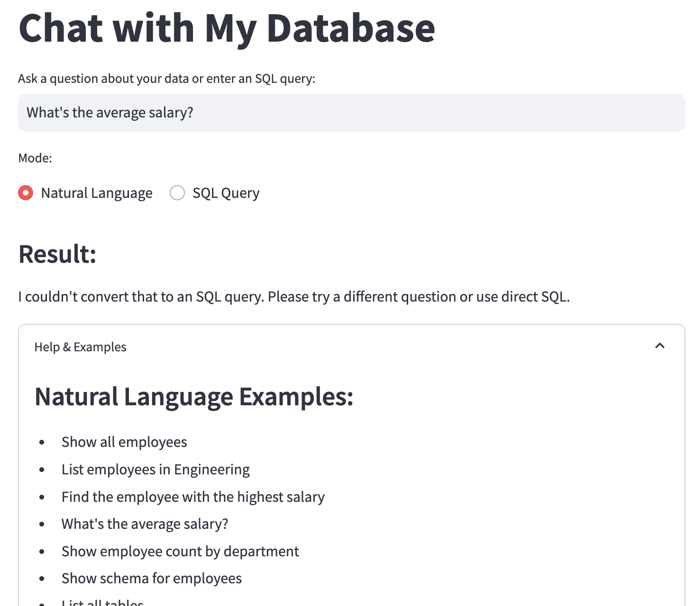

# chat-with-my-database

## Description
`chat-with-my-database` is a project that enables users to interact with their database using natural language. It leverages AI to translate user queries into SQL commands, making database management more intuitive and accessible.

## Usage
1. Clone the repository:
   ```bash
   git clone https://github.com/atrakic/chat-with-my-database.git
   cd chat-with-my-database
   ```

2. Install dependencies:
   ```bash
   uv sync
   ```

3. Configure your database connection in the `.env` file.

4. Start the application:
   ```bash
   uv run src/main.py
   ```

5. Open the application in your browser and start interacting with your database using natural language queries.



